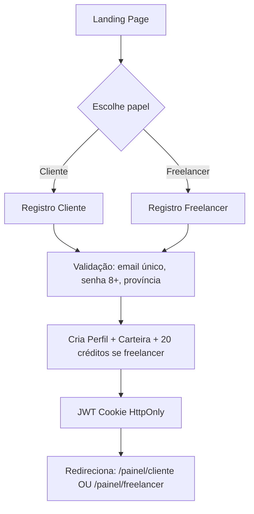
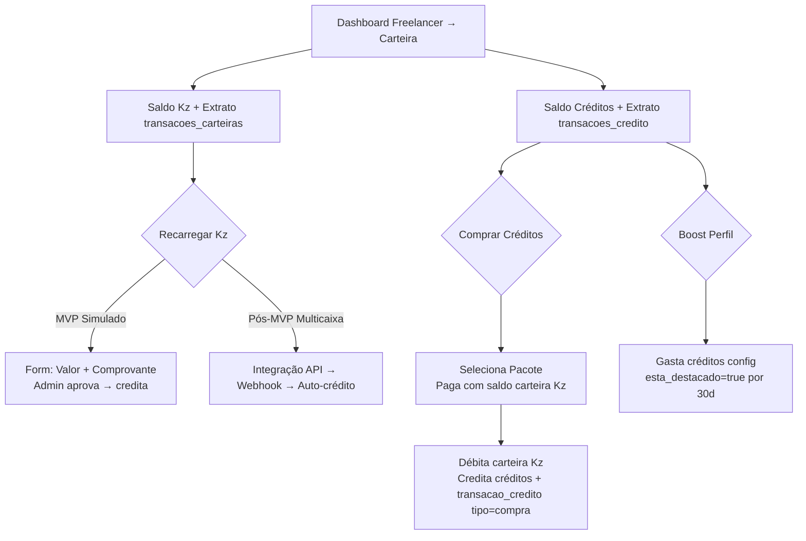

# Fluxos de Usuário — Skilla

**Status:** Draft
**Owner:** TODO(USER)
**Last updated:** 2026-09-26

---

## Convenções

- **Cliente** = usuário com `funcao=cliente`
- **Freelancer** = usuário com `funcao=freelancer`
- **Sistema** = ações automáticas (jobs, triggers, scheduler)
- **Admin** = usuário com papel admin (fora do escopo MVP, mas previsto)
- Setas: `→` = próxima etapa; `⟳` = loop/alternativa; `✗` = erro/falha

---

## Fluxo 1: Onboarding (Comum)



**Estados:** `visitante` → `registrado` → `autenticado` → `dashboard`

---

## Fluxo 2: Cliente — Publicar Job

```mermaid
flowchart TD
    A[Dashboard Cliente] --> B[Clicar "Novo Job"]
    B --> C[Wizard Passo 1: Básico<br/>Título, Categoria, Tipo Trabalho]
    C --> D[Wizard Passo 2: Orçamento<br/>Preço Fixo OU Por Hora + Valores]
    D --> E[Wizard Passo 3: Detalhes<br/>Descrição, Tamanho, Duração, Nível, Prazo, Anexos]
    E --> F[Wizard Passo 4: Skills<br/>Selecionar skills requeridas]
    F --> G[Wizard Passo 5: Revisão<br/>Resumo completo]
    G --> H{Salvar rascunho OU Publicar?}
    H -->|Rascunho| I[Status: rascunho<br/>Editável depois]
    H -->|Publicar| J[Validação rigorosa<br/>Campos obrigatórios]
    J -->|Falha| K[Erros inline → Volta ao passo]
    J -->|Sucesso| L[Status: aberto<br/>expira_em = +30d<br/>Notifica freelancers match]
    L --> M[Job visível no feed]
```

**Regras:** Apenas cliente; rascunho não aparece no feed; publicação exige validação completa.

---

## Fluxo 3: Freelancer — Descobrir e Propor

```mermaid
flowchart TD
    A[Dashboard Freelancer] --> B[Feed de Jobs<br/>Filtros: cat, orçamento, nível, local, busca]
    B --> C[Clica Job → Detalhe]
    C --> D{Verifica elegibilidade}
    D -->|Sem créditos| E[Modal: Comprar créditos<br/>Pacotes disponíveis]
    D -->|Já propôs| F[Msg: "Já enviou proposta"]
    D -->|Job fechado| G[Msg: "Não aceita propostas"]
    D -->|OK| H[Formulário Proposta<br/>Carta 50-2000 chars, Valor, Prazo]
    H --> I[Enviar → DB Transaction]
    I --> J[Débito 1 crédito<br/>Cria Proposta status=pendente]
    J --> K[Notifica Cliente<br/>Atualiza contadores]
    K --> L[Redirect: Minhas Propostas]
```

**Regras:** 1 crédito/proposta; max 15 propostas/job; job deve estar `aberto` e `proposals_open=true`.

---

## Fluxo 4: Cliente — Avaliar e Aceitar Proposta

```mermaid
flowchart TD
    A[Dashboard Cliente → Meus Jobs] --> B[Clica Job → Aba Propostas]
    B --> C[Lista propostas: Freelancer, Valor, Prazo, Carta, Avaliação, Portfólio]
    C --> D{Decisão}
    D -->|Rejeitar| E[Proposta → rejeitada<br/>Notifica Freelancer]
    D -->|Aceitar| F[Verifica saldo carteira cliente ≥ valor]
    F -->|Saldo insuficiente| G[Modal: Recarregar carteira<br/>(simulado no MVP)]
    F -->|OK| H[DB Transaction Atômico]
    H --> I[Cria Contrato<br/>valor_acordado, 10% comissão, 90% freelancer]
    I --> J[Escrow: Débita cliente → transacoes_escrow status=retido]
    J --> K[Cria Conversa (Chat)<br/>Notifica ambos]
    K --> L[Job: proposals_open=false, status=em_andamento]
    L --> M[Redirect: Sala de Trabalho (Chat)]
```

**Estados críticos:** `proposta.pendente` → `contrato.ativo` + `escrow.retido` + `chat.aberto` — tudo atômico.

---

## Fluxo 5: Execução — Chat e Entrega

```mermaid
flowchart TD
    A[Sala de Trabalho (Chat)] --> B[Troca mensagens + arquivos<br/>WebSocket tempo real]
    B --> C{Freelancer pronto para entregar}
    C --> D[Botão "Entregar Trabalho Final"]
    D --> E[Confirmação explícita modal]
    E --> F[Contrato: trabalho_entregue_em = now()]
    F --> G[Notifica Cliente: "Trabalho entregue, revise e aprove"]
    G --> H[Cliente revisa arquivos no chat]
    H --> I{Decisão Cliente}
    I -->|Solicita ajustes| J[Comenta no chat<br/>Freelancer reentrega]
    I -->|Aprova| K[Fluxo 6: Aprovação e Liberação]
    I -->|Não concorda| L[Abre Disputa → Fluxo 7]
```

**Regras:** Apenas freelancer do contrato pode entregar; cliente só vê botão aprovar após `trabalho_entregue_em` preenchido.

---

## Fluxo 6: Aprovação e Liberação (Sucesso)

```mermaid
flowchart TD
    A[Cliente clica "Aprovar Entrega"] --> B[Modal confirmação: "Liberar 90% para freelancer, 10% para plataforma?"]
    B --> C[DB Transaction]
    C --> D[Escrow: status=liberado, liberado_em=now()]
    D --> E[Carteira Freelancer: +90% (credito_escrow)]
    E --> F[Carteira Plataforma: +10% (comissao)]
    F --> G[Contrato: status=concluido, status_pagamento=liberado, aprovado_em=now()]
    G --> H[Job: status=concluido]
    H --> I[Freelancer: total_trabalhos_concluidos++]
    I --> J[Notifica ambos: "Pagamento liberado!"]
    J --> K[Dispara Avaliação bilateral → Fluxo 8]
```

**Atomicidade:** Tudo em `DB::transaction()` com `lockForUpdate` nas carteiras.

---

## Fluxo 7: Disputa (Conflito)

```mermaid
flowchart TD
    A[Qualquer parte clica "Reportar Problema / Abrir Disputa"] --> B[Modal: Motivo obrigatório]
    B --> C[DB Transaction]
    C --> D[Contrato: status_contrato=em_disputa]
    D --> E[Cria Disputa: aberta_por, motivo, status=aberta]
    E --> F[Escrow: CONGELADO (não pode liberar/reembolsar)]
    F --> G[Notifica outra parte + Admin]
    G --> H[Painel Admin: Lista disputas abertas]
    H --> I[Admin analisa: Chat, Arquivos, Contrato, Evidências]
    I --> J{Decisão Admin}
    J -->|Favor Cliente| K[Escrow: reembolsarTotal → 100% cliente<br/>Contrato: cancelado, devolvido_cliente]
    J -->|Favor Freelancer| L[Escrow: liberar → 90% freelancer + 10% plataforma<br/>Contrato: concluido, liberado]
    J -->|Acordo Mútuo| M[Split custom definido pelo admin]
    K --> N[Notifica ambos + fecha disputa]
    L --> N
    M --> N
```

**Regra:** Durante `em_disputa`, botões Entregar/Aprovar desabilitados.

---

## Fluxo 8: Avaliação Bilateral

```mermaid
flowchart TD
    A[Contrato concluido + pagamento liberado] --> B[Ambas partes veem "Avaliar" no dashboard/contrato]
    B --> C[Formulário: 1-5 estrelas + Comentário opcional]
    C --> D[Submit → Valida: unique(contrato_id, avaliador_id)]
    D --> E[Cria Avaliação]
    E --> F[Atualiza Perfil Avaliado: avg_rating, total_avaliacoes]
    F --> G[Notifica avaliado: "Você recebeu nova avaliação"]
```

**Regra:** Só após `contrato.status=concluido` E `status_pagamento=liberado`.

---

## Fluxo 9: Carteira e Créditos (Freelancer)



---

## Fluxo 10: Expiração Automática (Sistema)

```mermaid
flowchart TD
    A[Scheduler Daily 00:00] --> B[Job::where('status','aberto')->where('expira_em','<',now())]
    B --> C[Para cada job: status=cancelado]
    C --> D[Notifica Cliente: "Job expirado por inatividade"]
    C --> E[Notifica Freelancers com propostas: "Job cancelado"]
    F[Scheduler Daily 01:00] --> G[Highlights expirados → esta_destacado=false]
    H[Scheduler Daily 03:00] --> I[Reconciliação Carteiras]
```

---

## Fluxos Alternativos e Edge Cases

| Cenário | Fluxo Principal | Alternativa |
|---------|----------------|-------------|
| Cliente cancela job `aberto` sem propostas | Fluxo 2 | `JobPolicy::cancel` → status `cancelado`; notifica |
| Freelancer tenta propor sem créditos | Fluxo 3 | Modal compra créditos (Fluxo 9) |
| Cliente aceita proposta mas saldo=0 | Fluxo 4 | Bloqueia aceitação; modal recarga |
| Freelancer não entrega (prazo passa) | Fluxo 5 | Cliente abre disputa (Fluxo 7) ou espera |
| Cliente não aprova nem disputa | Fluxo 5/6 | Job expira em 30d (Fluxo 10) → cancelado; escrow reembolsa? **Regra:** Se job expira com contrato ativo → admin decide |
| Avaliação não feita em 14 dias | Fluxo 8 | Expira oportunidade avaliar (não bloqueia) |
| Freelancer destaca perfil, depois edita skills | Fluxo 9 | Boost mantém até `destaque_expira_em` |

---

## Related docs
- [use-cases.md](use-cases.md)
- [business-rules.md](business-rules.md)
- [functional-requirements.md](functional-requirements.md)
- [../05-design/screen-mapping.md](../05-design/screen-mapping.md)
- [../05-design/screen-specification.md](../05-design/screen-specification.md)