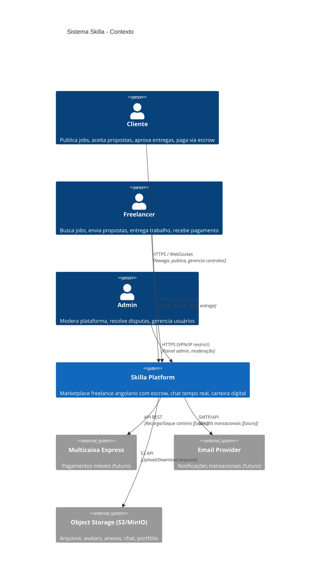
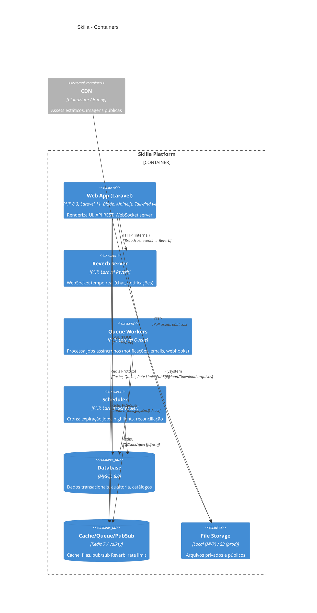
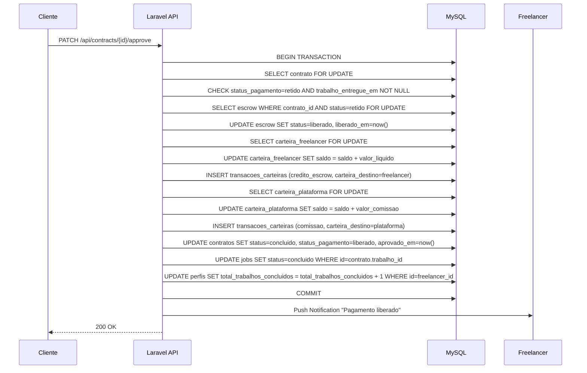
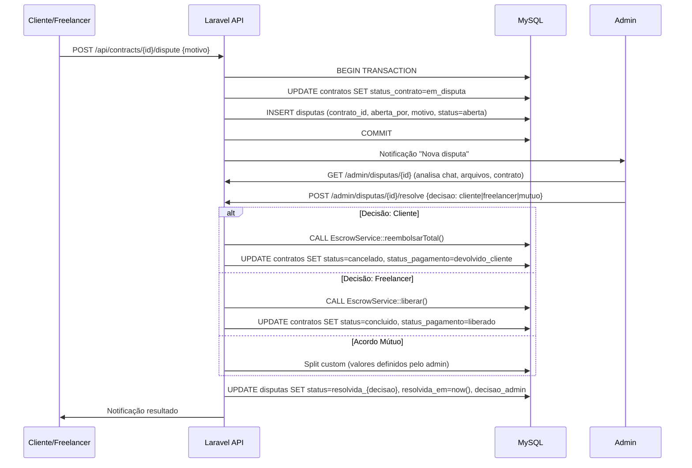

# Documento de Arquitetura — Skilla

**Status:** Draft
**Owner:** TODO(USER)
**Last updated:** 2026-09-26

---

## Visão Geral

Arquitetura **MVC Laravel 11** (PHP 8.3) com **Blade + Alpine.js + Tailwind CSS v4** no frontend, **MySQL 8** como banco principal, **Redis** para cache/queue/pubsub, **Laravel Reverb** para WebSockets. Padrão **modular por domínio** (Services, Policies, FormRequests) com separação clara de responsabilidades.

---

## Diagrama de Contexto (C4 Level 1)



---

## Diagrama de Containers (C4 Level 2)



---

## Módulos e Boundaries (Domínios)

```
app/
├── Http/
│   ├── Controllers/          # Camada de apresentação (thin)
│   │   ├── AuthController.php
│   │   ├── JobController.php
│   │   ├── ProposalController.php
│   │   ├── ContractController.php
│   │   ├── EscrowController.php
│   │   ├── WalletController.php
│   │   ├── ChatController.php
│   │   ├── ReviewController.php
│   │   └── ...
│   ├── Requests/             # FormRequests (validação + autorização)
│   │   ├── JobStoreRequest.php
│   │   ├── ProposalStoreRequest.php
│   │   └── ...
│   └── Resources/            # API Resources (transformação saída)
├── Models/                   # Eloquent Models (data + relationships)
│   ├── Perfil.php
│   ├── Job.php (Trabalho)
│   ├── Proposal.php (Proposta)
│   ├── Contract.php
│   ├── Wallet.php (Carteira)
│   ├── EscrowTransaction.php
│   ├── WalletTransaction.php
│   ├── Conversation.php
│   ├── Message.php
│   ├── Review.php
│   └── ...
├── Services/                 # Lógica de negócio (Domain Services)
│   ├── JobService.php
│   ├── ProposalService.php
│   ├── ContractService.php
│   ├── EscrowService.php
│   ├── WalletService.php
│   ├── CreditService.php
│   ├── ChatService.php
│   ├── NotificationService.php
│   └── ...
├── Policies/                 # Autorização granular
│   ├── JobPolicy.php
│   ├── ProposalPolicy.php
│   ├── ContractPolicy.php
│   ├── ConversationPolicy.php
│   └── ...
├── Events/                   # Eventos de domínio
│   ├── JobPublished.php
│   ├── ProposalSubmitted.php
│   ├── ProposalAccepted.php
│   ├── WorkDelivered.php
│   ├── WorkApproved.php
│   ├── DisputeOpened.php
│   └── ...
├── Listeners/                # Side-effects (notificações, emails, logs)
│   ├── SendProposalNotification.php
│   ├── SendChatNotification.php
│   └── ...
├── Broadcasting/             # Canais WebSocket
│   └── ConversationChannel.php
├── Console/Commands/         # Crons / CLI
│   ├── ExpireJobs.php
│   ├── ExpireHighlights.php
│   ├── ReconcileWallets.php
│   └── ...
└── Traits/
    └── HasUuid.php
```

### Princípios de Separação

| Camada | Responsabilidade | Exemplo |
|--------|------------------|---------|
| **Controller** | Recebe request, valida (FormRequest), chama Service, retorna response | `JobController::publish()` |
| **FormRequest** | Validação de entrada + autorização (`authorize()`) | `JobPublishRequest` |
| **Service** | Lógica de negócio, transações, orquestração | `JobService::publishJob()` |
| **Model** | Dados, relacionamentos, accessors, scopes | `Job::scopeOpen()` |
| **Policy** | Autorização por recurso/ação | `JobPolicy::update()` |
| **Event/Listener** | Desacoplamento side-effects | `ProposalAccepted` → `SendNotification` |
| **Broadcast** | Tempo real | `ConversationChannel` |

---

## Componentes Principais

### 1. Auth & Perfis (`AuthController`, `Perfil`, `Provincia`)
- JWT stateless (`tymon/jwt-auth`) em cookie HttpOnly
- Registro: cria `Perfil` + `Carteira` + 20 créditos (freelancer)
- Roles: `cliente`, `freelancer` (middleware `role:`)
- Provincias: 18 províncias Angola (seed)

### 2. Jobs (`JobController`, `JobService`, `Job`, `TrabalhoHabilidade`, `JobAttachment`)
- Wizard 5 passos: rascunho → publicado
- Status: `rascunho`, `aberto`, `em_andamento`, `concluido`, `cancelado`, `arquivado`
- Filtros avançados + busca textual + ordenação
- Expiração automática (scheduler 30 dias)

### 3. Propostas (`ProposalController`, `ProposalService`, `Proposta`)
- 1 crédito por proposta (débito atômico)
- Validações: job aberto, não propôs antes, tem créditos
- Aceitação → cria Contrato + Escrow + Conversa (transação única)

### 4. Contratos & Escrow (`ContractController`, `ContractService`, `EscrowService`, `Contrato`, `EscrowTransaction`)
- Contrato imutável após criação (valores snapshot)
- Escrow: retenção (débito cliente) → liberação (90% freelancer + 10% plataforma) OU reembolso total
- Estados contrato: `ativo`, `em_disputa`, `concluido`, `cancelado`
- Estados pagamento: `pendente`, `retido`, `liberado`, `devolvido_cliente`

### 5. Carteira & Créditos (`WalletController`, `WalletService`, `CreditService`, `Carteira`, `WalletTransaction`, `CreditTransaction`)
- Carteira por usuário + 1 carteira plataforma (singleton)
- Transações: `recarga`, `debito_escrow`, `credito_escrow`, `reembolso_escrow`, `saque`, `comissao`, `compra_creditos`
- Créditos: `compra`, `gasto_proposta`, `boost`, `ajuste_admin`
- Locking pessimista (`lockForUpdate`) em débitos/créditos
- Reconciliação diária (scheduler)

### 6. Chat Tempo Real (`ChatController`, `ChatService`, `Conversation`, `Message`, `Reverb`)
- 1 conversa por contrato (criada na aceitação)
- Canal privado `conversation.{id}` (auth JWT)
- Mensagens: texto + arquivo (PDF, img ≤ 5MB)
- Histórico paginado; marcação lida; contador não lidas

### 7. Avaliações (`ReviewController`, `ReviewService`, `Review` / `Avaliacao`)
- Bilateral após contrato `concluido` + `liberado`
- Unique (contrato, avaliador); 1–5 estrelas + comentário
- Atualiza `perfil.avaliacao_media` + `total_avaliacoes` via event

### 8. Notificações (`NotificationController`, `NotificationService`, `Notificacao`)
- In-app (tabela `notificacoes`); tipos: proposta, chat, contrato, disputa, sistema
- Lista paginada + marcação lida individual/todas

### 9. Disputas (`DisputeController`, `Dispute` / `Disputa`)
- Aberta por qualquer parte → congela contrato + escrow
- Admin decide: favor cliente (reembolso 100%) / favor freelancer (liberação 90/10) / acordo mútuo

### 10. Admin (`AdminController` — futuro)
- Métricas, usuários, jobs, contratos, disputas, transações
- Ações: banir, ajustar saldos, forçar resolução

---

## Sequências Críticas

### Sequência 1: Aceitar Proposta → Criar Contrato + Escrow + Chat

```mermaid
sequenceDiagram
    participant Client as Cliente
    participant API as Laravel API
    participant DB as MySQL
    participant Reverb as Reverb
    participant Freelancer as Freelancer

    Client->>API: POST /api/proposals/{id}/accept
    API->>DB: BEGIN TRANSACTION
    API->>DB: SELECT carteira_cliente FOR UPDATE
    API->>DB: CHECK saldo >= valor
    API->>DB: UPDATE carteira_cliente SET saldo = saldo - valor
    API->>DB: INSERT transacoes_carteiras (debito_escrow)
    API->>DB: INSERT contratos (valor_acordado, comissao=10%, valor_freelancer=90%)
    API->>DB: INSERT transacoes_escrow (status=retido, valor_comissao, valor_liquido)
    API->>DB: INSERT conversas (contrato_id, cliente_id, freelancer_id)
    API->>DB: UPDATE jobs SET proposals_open=false, status=em_andamento, proposta_aceita_id
    API->>DB: UPDATE propostas SET status=aceita WHERE id={id}; UPDATE propostas SET status=rejeitada WHERE trabalho_id={job_id} AND id!={id}
    API->>DB: COMMIT
    API->>Reverb: Broadcast "ContractCreated" para canal conversation.{id}
    API->>Freelancer: Push Notification (via queue)
    API-->>Client: 200 OK { contrato, conversa }
```

### Sequência 2: Aprovar Entrega → Liberar Escrow



### Sequência 3: Disputa → Congelamento → Resolução Admin



---

## Fluxo de Dados (Data Flow)

```
┌─────────────┐     ┌─────────────┐     ┌─────────────┐     ┌─────────────┐
│   Cliente   │────▶│   Job       │────▶│  Propostas  │────▶│  Contrato   │
│  (Cria)     │     │  (Rascunho  │     │  (Freelancer│     │  (Aceita)   │
│             │     │  → Aberto)  │     │   Propõe)   │     │             │
└─────────────┘     └─────────────┘     └─────────────┘     └──────┬──────┘
                                                                    │
                                                                    ▼
┌─────────────┐     ┌─────────────┐     ┌─────────────┐     ┌─────────────┐
│  Avaliação  │◀────│  Liberação  │◀────│   Escrow    │◀────│   Chat /    │
│  (Bilateral)│     │  (90/10)    │     │  (Retido)   │     │   Entrega   │
└─────────────┘     └─────────────┘     └─────────────┘     └─────────────┘
       ▲                                                                │
       │                                                                │
       └────────────────── Disputa (congela) ─────────────────────────┘
```

---

## Related docs
- [TRD.md](TRD.md)
- [tech-stack.md](tech-stack.md)
- [dev-plan.md](dev-plan.md)
- [coding-standards.md](coding-standards.md)
- [security-guidelines.md](security-guidelines.md)
- [../01-product/business-rules.md](../01-product/business-rules.md)
- [../03-data/database-schema.md](../03-data/database-schema.md)
- [../04-api/api-specification.md](../04-api/api-specification.md)