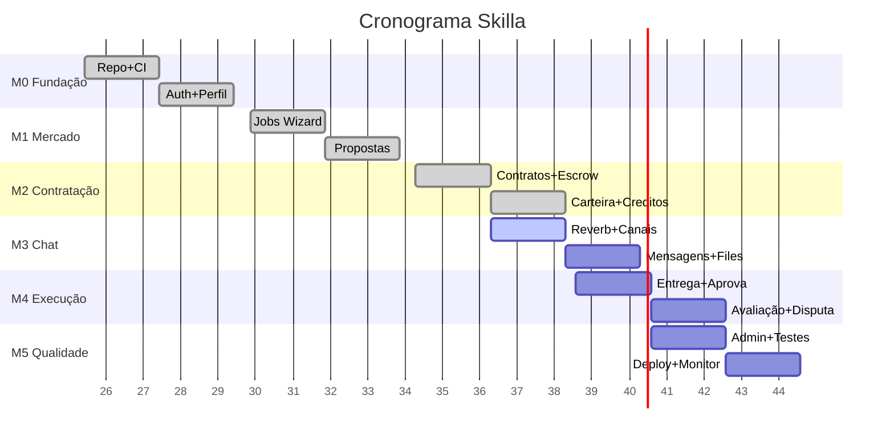

# Plano de Desenvolvimento — Skilla

**Status:** Draft
**Owner:** TODO(USER)
**Last updated:** 2026-09-26

---

## Visão Geral

Plano por marcos (milestones) do MVP ao v1.0, com dependências, ordem recomendada e checklists de qualidade.

---

## Marcos (Milestones)

### M0 — Fundação (Semanas 1–2) ✅ **CONCLUÍDO**
| Item | Status | Detalhes |
|------|--------|----------|
| Repo + CI/CD | ✅ | GitHub Actions: lint, test, build |
| Laravel 11 + PHP 8.3 | ✅ | `composer create-project laravel/laravel` |
| MySQL + Redis + Reverb | ✅ | Docker Compose local; Ubuntu VM staging |
| Auth JWT (registro, login, logout, refresh) | ✅ | `tymon/jwt-auth` + cookie HttpOnly |
| Perfis (cliente/freelancer) + Províncias | ✅ | CRUD, avatar, skills, 20 créditos grátis |
| Carteira auto-criada no registro | ✅ | `WalletService::getOrCreateWallet()` |
| Seeders: províncias, categorias, skills, carteira plataforma | ✅ | `php artisan db:seed` |
| Testes unitários Auth/Perfil | ✅ | Pest ≥ 70% coverage |

---

### M1 — Mercado: Jobs & Propostas (Semanas 3–4) ✅ **CONCLUÍDO**
| Item | Status | Detalhes |
|------|--------|----------|
| Wizard Job (5 passos) rascunho → publicado | ✅ | `JobService::saveDraft()` + `publishJob()` |
| Listagem + Filtros + Busca + Ordenação | ✅ | `JobController::index2()` |
| Detalhe Job + Views tracking + Save/Unsave | ✅ | `JobController::show()` |
| Expiração automática (cron 30 dias) | ✅ | `ExpireJobs` command + Scheduler |
| Envio Proposta (créditos, validações) | ✅ | `ProposalService::store()` |
| Gestão Propostas Cliente (aceitar/rejeitar) | ✅ | `ProposalController::accept()` |
| Notificações: proposta recebida, aceita/rejeitada | ✅ | `NotificationService` + Events |

---

### M2 — Contratação: Contratos, Escrow, Carteira (Semanas 5–6) ✅ **CONCLUÍDO**
| Item | Status | Detalhes |
|------|--------|----------|
| Criação Contrato atômica (aceitar proposta) | ✅ | `ContractService::createFromProposal()` |
| Escrow: Retenção (débito cliente → retido) | ✅ | `EscrowService::reter()` |
| Escrow: Liberação (90% freelancer + 10% plataforma) | ✅ | `EscrowService::liberar()` |
| Escrow: Reembolso total (disputa favor cliente) | ✅ | `EscrowService::reembolsarTotal()` |
| Carteira: Saldo, Extrato, Recarga (simulada) | ✅ | `WalletController` + `WalletService` |
| Créditos: Compra pacotes, Gasto proposta, Boost | ✅ | `CreditService` + `CreditosController` |
| Transações imutáveis (auditoria) | ✅ | `transacoes_carteiras`, `transacoes_escrow`, `transacoes_credito` |
| Locking pessimista (`lockForUpdate`) | ✅ | `WalletService::debitar/depositar` |
| Reconciliação diária (scheduler) | ✅ | `ReconcileWallets` command |

---

### M3 — Comunicação: Chat Tempo Real (Semanas 7–8) 🟡 **EM ANDAMENTO**
| Item | Status | Detalhes |
|------|--------|----------|
| Laravel Reverb instalado + configurado | ✅ | `php artisan reverb:install` |
| Canais privados `conversation.{id}` + auth JWT | ✅ | `routes/channels.php` |
| Conversa criada na aceitação de proposta | ✅ | `ContractService::createFromProposal()` |
| Mensagens texto + arquivos (PDF, img ≤ 5MB) | 🟡 | `ChatController::send()` — validar upload |
| Histórico paginado + marcação lida + badge | 🟡 | `ChatController::messages()` |
| Notificação push/in-app nova mensagem | 🟡 | `Broadcast::channel` + Listener |
| Testes WebSocket (Pest + Reverb testing) | ❌ | Pendente |

---

### M4 — Execução: Entrega, Aprovação, Avaliação (Semanas 9–10) 🟡 **PARCIAL**
| Item | Status | Detalhes |
|------|--------|----------|
| Freelancer: "Entregar Trabalho Final" | ✅ | `ContractService::submitWork()` |
| Cliente: "Aprovar Entrega" → Libera escrow | ✅ | `ContractService::approveWork()` |
| Job → `concluido`; Freelancer `total_trabalhos_concluidos++` | ✅ | `ContractService::approveWork()` |
| Avaliação bilateral (1–5 estrelas + comentário) | ✅ | `ReviewController::store()` |
| Atualização `avaliacao_media` + `total_avaliacoes` | ✅ | Event `ReviewSubmitted` → Listener |
| Disputas: Abrir + Congelar + Admin resolve | 🟡 | `DisputeController` — UI admin pendente |
| Notificações: entrega, aprovação, disputa, avaliação | 🟡 | Parcial |

---

### M5 — Qualidade, Admin, Polish, Deploy (Semanas 11–12) ❌ **PENDENTE**
| Item | Status | Detalhes |
|------|--------|----------|
| Admin Panel básico (Filament ou custom) | ❌ | Usuários, Jobs, Contratos, Disputas, Transações |
| Testes Feature fluxos críticos (UC01–UC15) | ❌ | Pest Feature ≥ 10 testes E2E |
| Testes concorrência carteira (k6) | ❌ | 50 VUs simultâneos debitar mesma carteira |
| Load test API (k6) | ❌ | 100 VUs, 5 min, P95 < 300ms |
| Penetration test básico (OWASP ZAP) | ❌ | Scan staging |
| Documentação API (Scribe / Scramble) | ❌ | Gerar OpenAPI 3.0 |
| PWA: Service Worker + Manifest + Push API | ❌ | `vite-plugin-pwa` |
| Deploy Produção (VPS Ubuntu + Nginx + Supervisor) | ❌ | Playbook Ansible / Script |
| Monitoramento: Prometheus + Grafana + Loki | ❌ | Dashboards: HTTP, Queue, WS, DB, Business |
| Backup automático + restore testado | ❌ | Cron + rclone → S3/Wasabi |
| Runbook: Incident response, rollback, scaling | ❌ | Docs ops |

---

## Dependências Entre Marcos

**Caminho Crítico:** M0 → M1 → M2 → M3 → M4 → M5 (sequencial). M3 e M4 podem sobrepor parcialmente.

---

## Checklist de Qualidade por Marco

| Critério | M0 | M1 | M2 | M3 | M4 | M5 |
|----------|----|----|----|----|----|----|
| **Testes Unitários** (≥70% Services) | ✅ | ✅ | ✅ | 🟡 | 🟡 | ✅ |
| **Testes Feature** (fluxos UC) | 🟡 | 🟡 | 🟡 | 🟡 | 🟡 | ✅ |
| **Static Analysis** (PHPStan L5) | ✅ | ✅ | ✅ | ✅ | ✅ | ✅ |
| **Code Style** (Pint) | ✅ | ✅ | ✅ | ✅ | ✅ | ✅ |
| **Migrações reversíveis** | ✅ | ✅ | ✅ | ✅ | ✅ | ✅ |
| **Seeders reproduzíveis** | ✅ | ✅ | ✅ | ✅ | ✅ | ✅ |
| **Documentação API** | ❌ | ❌ | ❌ | ❌ | ❌ | ✅ |
| **Observabilidade (logs/métricas)** | 🟡 | 🟡 | 🟡 | 🟡 | 🟡 | ✅ |
| **Segurança (rate limit, upload, auth)** | ✅ | ✅ | ✅ | 🟡 | 🟡 | ✅ |
| **Performance (índices, cache, queue)** | 🟡 | ✅ | ✅ | 🟡 | 🟡 | ✅ |
| **Acessibilidade (WCAG AA)** | 🟡 | 🟡 | 🟡 | 🟡 | 🟡 | ✅ |
| **Mobile-first (Tailwind breakpoints)** | ✅ | ✅ | ✅ | ✅ | ✅ | ✅ |

---

## Riscos e Mitigações no Cronograma

| Risco | Probabilidade | Impacto | Mitigação |
|-------|---------------|---------|-----------|
| Reverb instável em produção | Média | Alto | Testes de carga WS; fallback polling (Laravel Echo + Pusher) se crítico |
| Complexidade Escrow (concorrência) | Baixa | Crítico | Testes k6 intensivos; `lockForUpdate` + transações serializáveis |
| Atraso design/UI (Tailwind custom) | Média | Médio | Design system documentado (`ui-plan.md`); componentes reutilizáveis |
| Integração Multicaixa (futuro) | Alta | Alto | MVP com recarga manual admin; abstração `PaymentGateway` interface |
| Scope creep (features não planejadas) | Alta | Médio | Backlog priorizado; "não" por default; ADR para novas decisões |

---

## Definição de Pronto (Definition of Done) por Release

### MVP (M0–M4)
- [ ] Todos os fluxos UC01–UC10 funcionando E2E
- [ ] Testes Feature ≥ 15 cenários críticos passando
- [ ] Zero vulnerabilidades High/Critical (OWASP ZAP)
- [ ] P95 API < 300ms em staging (k6 50 VUs)
- [ ] Deploy staging automatizado (GitHub Actions → VPS)
- [ ] Runbook básico: logs, health check, rollback

### v1.0 (M5 + Pós-MVP)
- [ ] Admin panel funcional
- [ ] PWA instalável + Push notifications
- [ ] Multicaixa Express integrado (recarga/saque)
- [ ] KYC básico (BI + telefone + selfie upload)
- [ ] Documentação API pública (OpenAPI)
- [ ] Monitoramento completo (Prometheus + Grafana + Loki)
- [ ] Backup/restore testado mensalmente
- [ ] SLA 99.5% uptime (excl. manutenção)

---

## Related docs
- [TRD.md](TRD.md)
- [architeture-document.md](architeture-document.md)
- [tech-stack.md](tech-stack.md)
- [coding-standards.md](coding-standards.md)
- [security-guidelines.md](security-guidelines.md)
- [../01-product/MVP-scope.md](../01-product/MVP-scope.md)
- [../07-maintenance/changelog.md](../07-maintenance/changelog.md)