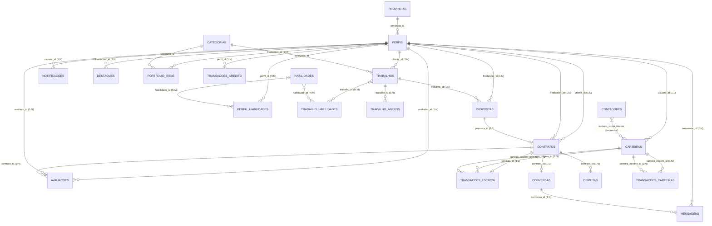

# Esquema do Banco de Dados — Skilla

**Status:** Draft
**Owner:** TODO(USER)
**Last updated:** 2026-09-26

---

## Visão Geral

Banco: **MySQL 8.0** (InnoDB)
Charset: `utf8mb4` / Collation: `utf8mb4_unicode_ci`
PKs: **UUID v4 (ordered)** — `HasUuid` trait
FKs: `ON DELETE CASCADE` (dependentes) / `SET NULL` (referências opcionais) / `RESTRICT` (catálogos)
Índices: Compostos para queries frequentes (`status + created_at`, `user_id + status`)
Money: `DECIMAL(15,2)` em **todas** colunas de valor (Kz/AOA)
Auditoria: Tabelas `transacoes_*` **apenas INSERT** (imutáveis)

---

## Diagrama Entidade-Relacionamento (Mermaid)

---

## Tabelas por Domínio

### 1. Catálogos e Localização

#### `provincias` (18 províncias Angola)
| Coluna | Tipo | Constraints |
|--------|------|-------------|
| `id` | UUID | PK |
| `nome` | VARCHAR(100) | NOT NULL, UNIQUE |
| `sigla` | VARCHAR(5) | UNIQUE |
| `criado_em` | TIMESTAMP | DEFAULT NOW() |

#### `categorias` (Design, Dev, Marketing, etc.)
| Coluna | Tipo | Constraints |
|--------|------|-------------|
| `id` | UUID | PK |
| `nome` | VARCHAR(100) | NOT NULL, UNIQUE |
| `slug` | VARCHAR(120) | NOT NULL, UNIQUE |
| `url_icone` | TEXT | NULL |
| `criado_em` | TIMESTAMP | DEFAULT NOW() |

#### `habilidades` (Skills normalizadas)
| Coluna | Tipo | Constraints |
|--------|------|-------------|
| `id` | UUID | PK |
| `nome` | VARCHAR(100) | NOT NULL, UNIQUE |
| `categoria` | VARCHAR(50) | NOT NULL |
| `criado_em` | TIMESTAMP | DEFAULT NOW() |

---

### 2. Usuários e Perfis

#### `perfis` (Entidade central — Cliente, Freelancer, Admin)
| Coluna | Tipo | Constraints | Notas |
|--------|------|-------------|-------|
| `id` | UUID | PK | |
| `primeiro_nome` | VARCHAR(100) | NOT NULL | |
| `sobrenome` | VARCHAR(100) | NOT NULL | |
| `nome_usuario` | VARCHAR(80) | NOT NULL, UNIQUE | Slug auto-gerado |
| `email` | VARCHAR(255) | NOT NULL, UNIQUE | |
| `password` | VARCHAR(255) | NOT NULL | Bcrypt hash |
| `funcao` | ENUM('cliente','freelancer') | NOT NULL | Role |
| `email_verified_at` | TIMESTAMP | NULL | |
| `remember_token` | VARCHAR(100) | NULL | Laravel |
| `provincia_id` | UUID | FK → provincias.id, SET NULL | |
| `localizacao` | TEXT | NULL | Bairro/endereço |
| `url_avatar` | TEXT | NULL | Storage path |
| `bio` | TEXT | NULL | |
| `telefone` | VARCHAR(30) | NULL | +244... |
| `saldo_creditos` | INT | NOT NULL, DEFAULT 10 | Apenas freelancer |
| `esta_destacado` | BOOLEAN | NOT NULL, DEFAULT FALSE | Boost ativo |
| `destaque_expira_em` | TIMESTAMP | NULL | Boost expiry |
| `avaliacao_media` | DECIMAL(3,2) | NOT NULL, DEFAULT 0.00 | 0.00–5.00 |
| `total_avaliacoes` | INT | NOT NULL, DEFAULT 0 | |
| `total_trabalhos_concluidos` | INT | NOT NULL, DEFAULT 0 | |
| `esta_ativo` | BOOLEAN | NOT NULL, DEFAULT TRUE | Soft ban |
| `criado_em` | TIMESTAMP | DEFAULT NOW() | |
| `atualizado_em` | TIMESTAMP | DEFAULT NOW() | |

**Índices:** `funcao`, `esta_ativo`, `esta_destacado`, `avaliacao_media`

#### `perfil_habilidades` (N:M Perfil ↔ Habilidade)
| Coluna | Tipo | Constraints |
|--------|------|-------------|
| `id` | UUID | PK |
| `perfil_id` | UUID | FK → perfis.id, CASCADE |
| `habilidade_id` | UUID | FK → habilidades.id, CASCADE |
| `criado_em` | TIMESTAMP | DEFAULT NOW() |
| **UNIQUE** | `(perfil_id, habilidade_id)` | |

---

### 3. Jobs (Trabalhos)

#### `trabalhos`
| Coluna | Tipo | Constraints | Notas |
|--------|------|-------------|-------|
| `id` | UUID | PK | |
| `cliente_id` | UUID | FK → perfis.id, CASCADE | Apenas clientes |
| `categoria_id` | UUID | FK → categorias.id, SET NULL | Opcional em rascunho |
| `titulo` | TEXT | NULL | Obrigatório ao publicar |
| `tamanho_projeto` | VARCHAR(20) | NULL | 'pequeno','medio','grande' |
| `duracao_estimada` | VARCHAR(50) | NULL | Ex: '1 a 3 meses' |
| `nivel_experiencia` | VARCHAR(20) | NULL | 'iniciante','intermediario','especialista' |
| `possibilidade_efetivacao` | BOOLEAN | DEFAULT FALSE | |
| `tipo_trabalho` | VARCHAR(20) | NULL | 'preco_fixo','por_hora' |
| `orcamento_fixo` | DECIMAL(15,2) | NULL | Se preco_fixo |
| `taxa_hora_min` | DECIMAL(15,2) | NULL | Se por_hora |
| `taxa_hora_max` | DECIMAL(15,2) | NULL | Se por_hora |
| `descricao` | TEXT | NULL | Obrigatório ao publicar |
| `status` | VARCHAR(20) | NOT NULL, DEFAULT 'rascunho' | 'rascunho','aberto','em_andamento','concluido','cancelado','arquivado' |
| `proposta_aceita_id` | UUID | FK → propostas.id, SET NULL | Setado na aceitação |
| `contagem_visualizacoes` | INT | DEFAULT 0 | |
| `prazo` | DATE | NULL | Deadline do job |
| `expira_em` | DATE | NULL | Auto-cancelamento (30d) |
| `criado_em` | TIMESTAMP | DEFAULT NOW() | |
| `atualizado_em` | TIMESTAMP | DEFAULT NOW() | |

**Índices:** `cliente_id`, `categoria_id`, `(status, criado_em)`, `expira_em`

#### `trabalho_habilidades` (N:M Trabalho ↔ Habilidade)
| Coluna | Tipo | Constraints |
|--------|------|-------------|
| `id` | UUID | PK |
| `trabalho_id` | UUID | FK → trabalhos.id, CASCADE |
| `habilidade_id` | UUID | FK → habilidades.id, CASCADE |
| **UNIQUE** | `(trabalho_id, habilidade_id)` | |

#### `trabalho_anexos` (Arquivos do Job)
| Coluna | Tipo | Constraints |
|--------|------|-------------|
| `id` | UUID | PK |
| `trabalho_id` | UUID | FK → trabalhos.id, CASCADE |
| `nome_arquivo` | TEXT | NOT NULL |
| `url_arquivo` | TEXT | NOT NULL |
| `tamanho_bytes` | INT | NULL |
| `criado_em` | TIMESTAMP | DEFAULT NOW() |

---

### 4. Propostas e Contratos

#### `propostas`
| Coluna | Tipo | Constraints | Notas |
|--------|------|-------------|-------|
| `id` | UUID | PK | |
| `trabalho_id` | UUID | FK → trabalhos.id, CASCADE | |
| `freelancer_id` | UUID | FK → perfis.id, CASCADE | Apenas freelancers |
| `carta_apresentacao` | TEXT | NOT NULL | 50–2000 chars |
| `valor_proposto` | DECIMAL(15,2) | NOT NULL | > 0 |
| `dias_entrega` | INT | NOT NULL | >= 1 |
| `status` | VARCHAR(20) | DEFAULT 'pendente' | 'pendente','aceita','rejeitada' |
| `creditos_gastos` | INT | DEFAULT 1 | |
| `criado_em` | TIMESTAMP | DEFAULT NOW() | |
| `atualizado_em` | TIMESTAMP | DEFAULT NOW() | |

**Índices:** `trabalho_id`, `(freelancer_id, status)`
**UNIQUE:** `(trabalho_id, freelancer_id)` — 1 proposta por freelancer/job

#### `contratos`
| Coluna | Tipo | Constraints | Notas |
|--------|------|-------------|-------|
| `id` | UUID | PK | |
| `trabalho_id` | UUID | FK → trabalhos.id, CASCADE | |
| `proposta_id` | UUID | FK → propostas.id, CASCADE | |
| `cliente_id` | UUID | FK → perfis.id, CASCADE | |
| `freelancer_id` | UUID | FK → perfis.id, CASCADE | |
| `status_contrato` | VARCHAR(20) | DEFAULT 'ativo' | 'ativo','em_disputa','concluido','cancelado' |
| `valor_acordado` | DECIMAL(15,2) | NOT NULL | = proposta.valor_proposto |
| `comissao_plataforma` | DECIMAL(15,2) | NULL | 10% (snapshot na retenção) |
| `valor_freelancer` | DECIMAL(15,2) | NULL | 90% (snapshot na retenção) |
| `dias_entrega` | INT | NOT NULL | = proposta.dias_entrega |
| `data_limite` | DATE | NULL | `criado_em + dias_entrega` |
| `status_pagamento` | VARCHAR(20) | DEFAULT 'pendente' | 'pendente','retido','liberado','devolvido_cliente' |
| `trabalho_entregue_em` | TIMESTAMP | NULL | Freelancer submete |
| `aprovado_em` | TIMESTAMP | NULL | Cliente aprova |
| `criado_em` | TIMESTAMP | DEFAULT NOW() | |
| `atualizado_em` | TIMESTAMP | DEFAULT NOW() | |

**Índices:** `cliente_id`, `freelancer_id`, `status_contrato`, `status_pagamento`

---

### 5. Financeiro (Escrow, Carteira, Créditos)

#### `carteiras` (1 por usuário + 1 plataforma)
| Coluna | Tipo | Constraints | Notas |
|--------|------|-------------|-------|
| `id` | UUID | PK | |
| `usuario_id` | UUID | FK → perfis.id, SET NULL, UNIQUE | NULL = carteira plataforma |
| `iban_virtual` | VARCHAR(21) | UNIQUE, NULL | Gerado via IbanService |
| `numero_conta_interno` | BIGINT | UNIQUE, NULL | Sequence via `contadores` |
| `saldo` | DECIMAL(15,2) | NOT NULL, DEFAULT 0.00 | **Nunca negativo** |
| `tipo` | VARCHAR(20) | NOT NULL, DEFAULT 'usuario' | 'usuario' \| 'plataforma' |
| `moeda` | VARCHAR(3) | NOT NULL, DEFAULT 'AOA' | Fixo Kz |
| `criado_em` | TIMESTAMP | DEFAULT NOW() | |
| `atualizado_em` | TIMESTAMP | DEFAULT NOW() | |

**Índices:** `tipo`, `usuario_id` (unique)

#### `transacoes_carteiras` (Auditoria imutável — Kz)
| Coluna | Tipo | Constraints | Notas |
|--------|------|-------------|-------|
| `id` | UUID | PK | |
| `carteira_origem_id` | UUID | FK → carteiras.id, SET NULL | NULL = entrada externa |
| `carteira_destino_id` | UUID | FK → carteiras.id, SET NULL | NULL = saída externa |
| `valor` | DECIMAL(15,2) | NOT NULL | Sempre positivo |
| `tipo` | VARCHAR(30) | NOT NULL | 'recarga','debito_escrow','credito_escrow','reembolso_escrow','saque','comissao','compra_creditos' |
| `metodo_pagamento` | VARCHAR(30) | DEFAULT 'interno' | 'multicaixa_express','transferencia','interno' |
| `descricao` | TEXT | NULL | |
| `id_referencia` | UUID | NULL | contrato_id, escrow_id, compra_creditos_id |
| `tipo_referencia` | VARCHAR(30) | NULL | 'contrato','escrow','compra_creditos','saque' |
| `status` | VARCHAR(20) | DEFAULT 'concluido' | 'pendente','concluido','falhou' |
| `criado_em` | TIMESTAMP | DEFAULT NOW() | **Imutável** |

**Índices:** `idx_carteiras_origem_destino` (`carteira_origem_id`, `carteira_destino_id`), `tipo_referencia`, `id_referencia`

#### `transacoes_escrow` (Auditoria imutável — Escrow)
| Coluna | Tipo | Constraints | Notas |
|--------|------|-------------|-------|
| `id` | UUID | PK | |
| `contrato_id` | UUID | FK → contratos.id, CASCADE | |
| `carteira_origem_id` | UUID | FK → carteiras.id | Cliente |
| `carteira_destino_id` | UUID | FK → carteiras.id | Freelancer |
| `valor` | DECIMAL(15,2) | NOT NULL | Total contrato |
| `valor_comissao` | DECIMAL(15,2) | NOT NULL | 10% (snapshot) |
| `valor_liquido_freelancer` | DECIMAL(15,2) | NOT NULL | 90% (snapshot) |
| `status_pagamento` | VARCHAR(20) | DEFAULT 'retido' | 'retido','liberado','devolvido_cliente' |
| `metodo_liberacao` | VARCHAR(30) | NULL | 'aprovacao_cliente','decisao_admin' |
| `retido_em` | TIMESTAMP | DEFAULT NOW() | |
| `liberado_em` | TIMESTAMP | NULL | |

**Imutável exceto:** `status_pagamento`, `liberado_em`, `metodo_liberacao`

#### `transacoes_credito` (Auditoria imutável — Créditos)
| Coluna | Tipo | Constraints | Notas |
|--------|------|-------------|-------|
| `id` | UUID | PK | |
| `perfil_id` | UUID | FK → perfis.id, CASCADE | |
| `quantidade` | INT | NOT NULL | +entrada / -saída |
| `tipo` | VARCHAR(30) | NOT NULL | 'compra','gasto_proposta','boost','ajuste_admin' |
| `descricao` | TEXT | NULL | |
| `id_referencia` | UUID | NULL | proposta_id, destaque_id |
| `tipo_referencia` | VARCHAR(30) | NULL | 'proposta','destaque' |
| `criado_em` | TIMESTAMP | DEFAULT NOW() | **Imutável** |

#### `contadores` (Sequência para `numero_conta_interno`)
| Coluna | Tipo | Constraints |
|--------|------|-------------|
| `id` | INT | PK (1) |
| `chave` | VARCHAR(50) | UNIQUE |
| `valor_atual` | BIGINT | |
| `atualizado_em` | TIMESTAMP | |

---

### 6. Comunicação

#### `conversas` (1 por Contrato)
| Coluna | Tipo | Constraints |
|--------|------|-------------|
| `id` | UUID | PK |
| `contrato_id` | UUID | FK → contratos.id, CASCADE, UNIQUE |
| `cliente_id` | UUID | FK → perfis.id, CASCADE |
| `freelancer_id` | UUID | FK → perfis.id, CASCADE |
| `ultima_mensagem_em` | TIMESTAMP | NULL |
| `criado_em` | TIMESTAMP | DEFAULT NOW() |

#### `mensagens`
| Coluna | Tipo | Constraints | Notas |
|--------|------|-------------|-------|
| `id` | UUID | PK | |
| `conversa_id` | UUID | FK → conversas.id, CASCADE | |
| `remetente_id` | UUID | FK → perfis.id, CASCADE | |
| `conteudo` | TEXT | NULL | Texto da mensagem |
| `tipo_mensagem` | VARCHAR(20) | DEFAULT 'texto' | 'texto','arquivo' |
| `url_arquivo` | TEXT | NULL | Storage path (privado) |
| `nome_arquivo` | TEXT | NULL | Nome original |
| `tamanho_arquivo` | INT | NULL | Bytes |
| `lida` | BOOLEAN | DEFAULT FALSE | |
| `criado_em` | TIMESTAMP | DEFAULT NOW() | **Sem updated_at** |

---

### 7. Avaliações e Disputas

#### `avaliacoes` (Reviews)
| Coluna | Tipo | Constraints | Notas |
|--------|------|-------------|-------|
| `id` | UUID | PK | |
| `contrato_id` | UUID | FK → contratos.id, CASCADE | |
| `avaliador_id` | UUID | FK → perfis.id, CASCADE | Quem avalia |
| `avaliado_id` | UUID | FK → perfis.id, CASCADE | Quem recebe |
| `nota` | TINYINT | NOT NULL | 1–5 |
| `comentario` | TEXT | NULL | Máx 1000 chars |
| `criado_em` | TIMESTAMP | DEFAULT NOW() | |

**UNIQUE:** `(contrato_id, avaliador_id)` — 1 avaliação por parte por contrato

#### `disputas`
| Coluna | Tipo | Constraints | Notas |
|--------|------|-------------|-------|
| `id` | UUID | PK | |
| `contrato_id` | UUID | FK → contratos.id, CASCADE | |
| `aberta_por` | UUID | FK → perfis.id, CASCADE | Cliente ou freelancer |
| `motivo` | TEXT | NOT NULL | |
| `status` | VARCHAR(30) | DEFAULT 'aberta' | 'aberta','em_analise','resolvida_cliente','resolvida_freelancer','acordo_mutuo' |
| `decisao_admin` | TEXT | NULL | Justificativa |
| `resolvida_em` | TIMESTAMP | NULL | |
| `criado_em` | TIMESTAMP | DEFAULT NOW() | |

---

### 8. Portfólio e Extras

#### `portfolio_itens`
| Coluna | Tipo | Constraints |
|--------|------|-------------|
| `id` | UUID | PK |
| `freelancer_id` | UUID | FK → perfis.id, CASCADE |
| `titulo` | TEXT | NOT NULL |
| `descricao` | TEXT | NULL |
| `url_imagem` | TEXT | NULL |
| `url_projeto` | TEXT | NULL |
| `categoria_id` | UUID | FK → categorias.id, SET NULL |
| `criado_em` | TIMESTAMP | DEFAULT NOW() |
| `atualizado_em` | TIMESTAMP | DEFAULT NOW() |

#### `destaques` (Boost de Perfil)
| Coluna | Tipo | Constraints |
|--------|------|-------------|
| `id` | UUID | PK |
| `freelancer_id` | UUID | FK → perfis.id, CASCADE |
| `status` | VARCHAR(20) | DEFAULT 'ativo' |
| `creditos_gastos` | INT | NOT NULL |
| `inicio_em` | TIMESTAMP | DEFAULT NOW() |
| `expira_em` | TIMESTAMP | NOT NULL |
| `criado_em` | TIMESTAMP | DEFAULT NOW() |

#### `notificacoes`
| Coluna | Tipo | Constraints |
|--------|------|-------------|
| `id` | UUID | PK |
| `usuario_id` | UUID | FK → perfis.id, CASCADE |
| `tipo` | VARCHAR(50) | NOT NULL | 'proposta_recebida','proposta_aceita','proposta_rejeitada','mensagem_chat','trabalho_entregue','trabalho_aprovado','disputa_aberta','disputa_resolvida','job_expirado','creditos_baixos' |
| `titulo` | TEXT | NOT NULL |
| `corpo` | TEXT | NOT NULL |
| `id_referencia` | UUID | NULL |
| `tipo_referencia` | VARCHAR(50) | NULL |
| `lida` | BOOLEAN | DEFAULT FALSE |
| `criado_em` | TIMESTAMP | DEFAULT NOW() |

#### `saved_jobs` (Favoritos Freelancer)
| Coluna | Tipo | Constraints |
|--------|------|-------------|
| `id` | UUID | PK |
| `job_id` | UUID | FK → trabalhos.id, CASCADE |
| `user_id` | UUID | FK → perfis.id, CASCADE |
| `criado_em` | TIMESTAMP | DEFAULT NOW() |
| **UNIQUE** | `(job_id, user_id)` | |

---

## Tabelas Legadas / Não Utilizadas (Existentes no Código)

| Tabela | Status | Notas |
|--------|--------|-------|
| `users` (Laravel default) | ❌ Não usada | Auth via `perfis` (JWT Subject) |
| `jobs` (snake_case plural EN) | ❌ Legada | Substituída por `trabalhos` |
| `job_skills` | ❌ Legada | Substituída por `trabalho_habilidades` |
| `job_categories` | ❌ Legada | Substituída por `categorias` |
| `proposals` (EN) | ❌ Legada | Substituída por `propostas` |
| `contracts` (EN) | ❌ Legada | Substituída por `contratos` |
| `wallets` (EN) | ❌ Legada | Substituída por `carteiras` |
| `wallet_transactions` | ❌ Legada | Substituída por `transacoes_carteiras` |
| `credit_transactions` | ❌ Legada | Substituída por `transacoes_credito` |
| `escrow_transactions` | ❌ Legada | Substituída por `transacoes_escrow` |
| `conversations` | ❌ Legada | Substituída por `conversas` |
| `messages` | ❌ Legada | Substituída por `mensagens` |
| `reviews` | ❌ Legada | Substituída por `avaliacoes` |
| `skills` (EN) | ❌ Legada | Substituída por `habilidades` |
| `profile_skills` | ❌ Legada | Substituída por `perfil_habilidades` |
| `categories` (EN) | ❌ Legada | Substituída por `categorias` |
| `portfolio_items` (EN) | ❌ Legada | Substituída por `portfolio_itens` |
| `highlights` (EN) | ❌ Legada | Substituída por `destaques` |
| `notifications` (EN) | ❌ Legada | Substituída por `notificacoes` |

> **Assumptions:** Migração para nomes PT-BR (`trabalhos`, `propostas`, `contratos`, `carteiras`, etc.) já concluída. Tabelas EN legadas podem ser removidas em limpeza futura.

---

## Related docs
- [database-dbml.md](database-dbml.md) (DBML completo)
- [data-mapping.md](data-mapping.md) (Mapeamento fluxos → tabelas)
- [data-dictionary.md](data-dictionary.md) (Dicionário campos críticos)
- [../02-architeture/architeture-document.md](../02-architeture/architeture-document.md) (Componentes)
- [../01-product/business-rules.md](../01-product/business-rules.md) (Regras por tabela)
- [../04-api/api-specification.md](../04-api/api-specification.md) (Endpoints → Entidades)